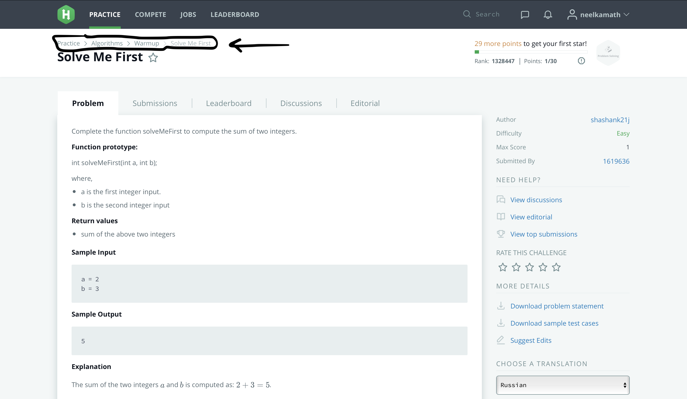

# HackerRank Solutions

These are my solutions for problems hosted on [HackerRank](https://hackerrank.com).

The committed solutions aren't to be modified unless I have made a new submission to HackerRank. The only exception is if if the code has simply been run through a linter. Only solutions which pass all of the test cases are to be committed.

Place solutions in the `src` directory using the structure HackerRank uses (as shown in the picture below).

# License

This project is under the [MIT License](LICENSE).
